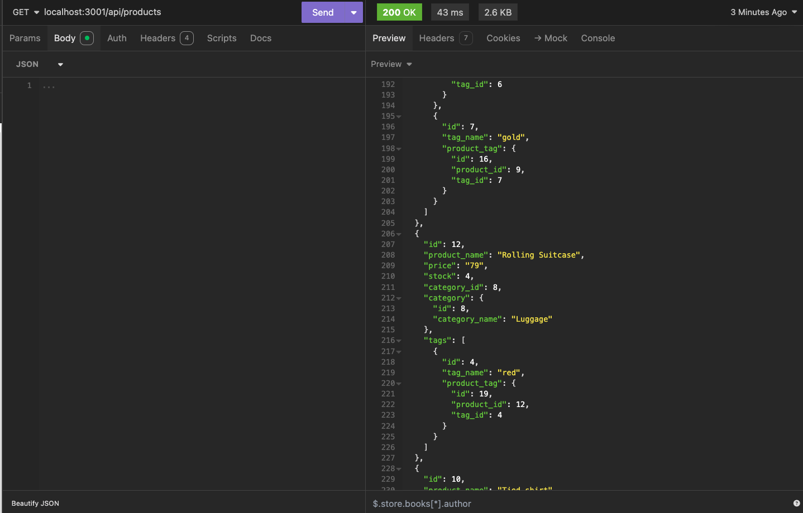
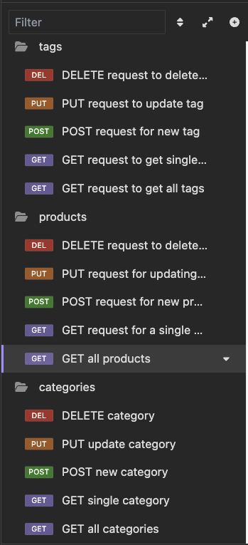

# E-Commerce-Back-End

## Description
This is a back end application for an e-commerce site that uses a working Express.js API that uses Sequelize to interact with a PostgreSQL database.  I started with starter code and had to add the models and associations, as well as the routes to handle all the GET, POST, PUT, and DELETE requests.  Because this application does not have a front end, users can interact with the database via a back-end endpoint tool such as Insomnia.  From that interface users can modify an e-commerce database with ease.

## Table of Contents
* [Installation](#installation)
* [Usage](#usage)
* [License](#license)
* [Contributing](#contributing)
* [Credits](#credits)
* [Tests](#tests)
* [Questions](#questions)

## Installation
Installation instructions for application:
To install dependencies run the command `npm i`
To seed the database run the command `npm run seed`

## Usage

Click [here]() for a video demonstration.

To use this project, clone the repository and ensure current versions of Node.js, PostgreSQL, and Insomnia are installed.  Install all necessary dependencies (see package.json for more details). Store credentials and sensitive information in a .env file (such as your database password).  Connect to postgreSQL via command line and run the schema.sql file to create the database for the application.  After the database is created, in the command line run `npm run seed` to seed the database with pre-entered data.  After successfully seeding database, run the command `node server.js` to start the application.  Then, open Insomnia and in the http request field, enter in the api url of the data you are trying to access.  This application has several endpoints built in:

Categories:
- GET api/categories to view all categories
- POST api/categories to add a category
- PUT api/categories/:id to modify a category
- DELETE api/categories/:id to delete a category

Products:
- GET api/products to view all products
- POST api/products to add a product
- PUT api/products/:id to modify a product
- DELETE api/products/:id to delete a product

Tags:
- GET api/tags to view all tags
- POST api/tags to add a tag
- PUT api/tags/:id to modify a tag
- DELETE api/tags/:id to delete a tag

## License 
This project is operating under the MIT license. For more detailed information about the license, please click [here](https://opensource.org/licenses/MIT).

## Contributing 
Please contact me for any contributions.

## Credits
N/A

## Tests
To run tests for the application:
N/A

## Questions 
Contact me with any questions regarding this project:

GitHub: [ElenaPapanikolas](https://github.com/ElenaPapanikolas)

Email: epapanikolas@hotmail.com
